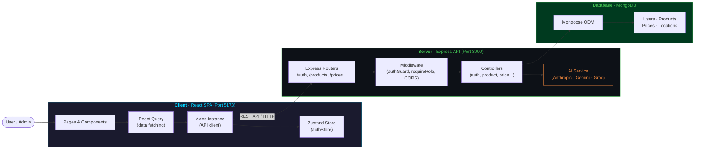
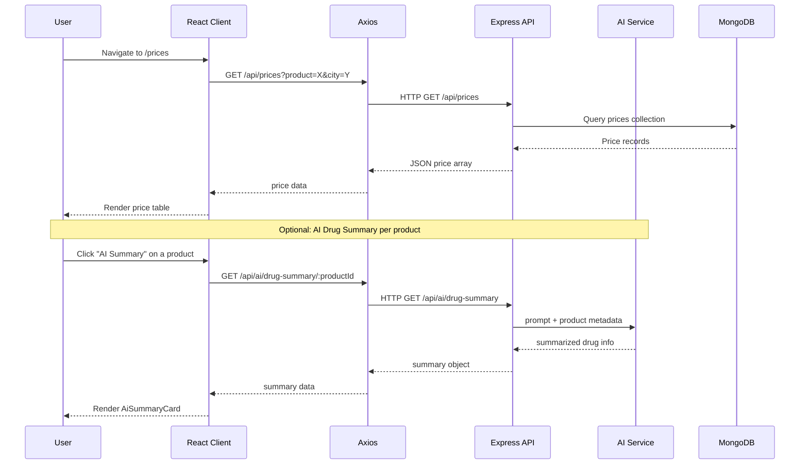
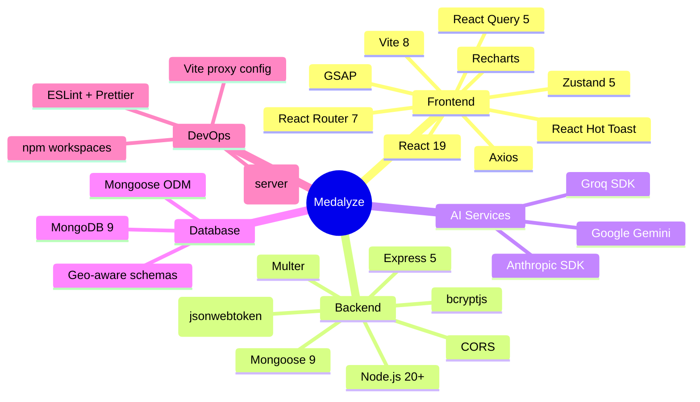

# Medalyze — Real-Time Hyperlocal Pharmaceutical Pricing Tracker using APIs

<!-- ============================================================
     HEADER & HERO IMAGE
     Replace the placeholder below with your own hero banner.
     Recommended size: 1280×640px
     ============================================================ -->


<p align="center">
  <strong>Precision pricing intelligence for the pharmaceutical supply chain.</strong>
</p>

---

## Overview

**Medalyze** is a full-stack web application that tracks, compares, and analyzes pharmaceutical product prices across hyperlocal retail outlets and pharmacies. Built with a React frontend and an Express backend connected to MongoDB, it empowers analysts, admins, and consumers to make data-driven purchasing decisions using real-time price data, AI-generated drug summaries, natural language search, and anomaly detection.

The system consists of two independent deployments:

- **Client** — A Vite-powered React SPA served on `http://localhost:5173`
- **Server** — An Express REST API running on `http://localhost:3000`

Both communicate over HTTP REST, with the client consuming JSON APIs secured by JWT authentication.

---

## Status Badges

```
License:    MIT
Build:      (replace with your CI badge URL)
Frontend:   React 19 · Vite 8 · Zustand 5
Backend:    Node.js · Express 5 · MongoDB · Mongoose 9
AI Models:  Anthropic · Google Gemini · Groq
```

| Badge | Label | Link |
|---|---|---|
|  | MIT | [MIT](https://opensource.org/licenses/MIT) |
|  | Node.js 20+ | [Node.js](https://nodejs.org/) |
|  | React 19 | [React](https://react.dev/) |
|  | MongoDB | [MongoDB](https://www.mongodb.com/) |
|  | Express 5 | [Express](https://expressjs.com/) |

---

## Visual Demo

<!-- ============================================================
     Replace the placeholder URLs below with actual screenshot
     paths or hosted images (e.g. via GitHub relative links or
     a CDN such as Cloudinary / ImgBB).
     Recommended size per screenshot: 800×500px
     ============================================================ -->

### Login & Authentication

| Screen | Description |
|---|---|
|  | Secure JWT-based login with role routing |
|  | User registration with role assignment |

### Core Dashboard

| Screen | Description |
|---|---|
|  | Real-time stats, charts, and AI summary card |
|  | Filterable/searchable drug catalog |
|  | Hyperlocal price comparison per city/pharmacy |
|  | Outlet-level pricing by geography |
|  | User management and system configuration |

---

## System Design & Architecture

Medalyze follows a classic **client–server–database three-tier architecture**. The React SPA (frontend) communicates exclusively with the Express REST API (backend) via JSON/HTTP. The backend owns all business logic, database access, and third-party AI service integrations. The MongoDB instance serves as the single source of truth for all application data.

### Component Interaction



### Data Flow — Price Lookup with AI Summary



### Technology Stack



---

## Tech Stack

### Frontend

| Technology | Version | Purpose |
|---|---|---|
|  | 19.x | UI library |
|  | 8.x | Build tool & dev server |
|  | 5.x | Lightweight state management |
|  | 5.x | Server-state & caching |
|  | 1.x | HTTP client |
|  | 7.x | Client-side routing |
|  | 3.x | Data visualization charts |
|  | 3.x | Animations |
|  | 2.x | Toast notifications |

### Backend

| Technology | Version | Purpose |
|---|---|---|
|  | 20+ | Runtime |
|  | 5.x | REST API framework |
|  | 9.x | Document database |
|  | 9.x | ODM for MongoDB |
|  | 9.x | Token-based authentication |
|  | 3.x | Password hashing |
|  | 0.82.x | Claude AI integration |
|  | 0.24.x | Google AI integration |
|  | 1.1.x | Groq AI integration |
|  | 2.8.x | Cross-Origin Resource Sharing |
|  | 17.x | Environment configuration |
|  | 3.x | Development auto-reload |

---

## How It Works (Under the Hood)

### 1. Authentication Flow

```
Register/Login → JWT issued → Token stored in localStorage
↓
Every Axios request → Bearer token attached via interceptor
↓
Server authGuard middleware → Validates JWT → Decodes user role
↓
Role-based access → AdminRoute / ProtectedRoute wrappers on client
```

### 2. Core Workflows

#### a. Price Submission & Approval
1. Authenticated user submits a price for a product at a location.
2. Backend stores price with `status: "pending"`.
3. Admin reviews and approves/rejects via `/api/admin/prices`.
4. Approved prices become visible in price comparison queries.

#### b. AI Drug Summary
1. User navigates to a product detail or clicks "Summarize" on a drug card.
2. Frontend calls `GET /api/ai/drug-summary/:productId`.
3. Backend fetches product metadata from MongoDB.
4. Backend calls Anthropic/Gemini/Groq with a structured prompt.
5. AI summary is returned and displayed in `AiSummaryCard`.

#### c. Natural Language Price Search
1. User types a query like *"panadol products under 500 in colombo"*.
2. Frontend POSTs to `POST /api/ai/parse-search` with the raw query.
3. AI service parses intent → returns structured filter object `{ priceMax: 500, city: "colombo", keyword: "panadol" }`.
4. Frontend applies those filters to the product/price API calls.

#### d. Price Anomaly Detection
1. Admin submits a new price entry.
2. Backend calls `POST /api/ai/check-anomaly` with `{ productId, submittedPrice, city }`.
3. AI compares `submittedPrice` against the product's average approved price.
4. Returns `{ flagged: boolean, ratio: number, reason: string }`.
5. Flagged prices are highlighted in the UI for review.

### 3. API Data Fetching Pattern

The frontend uses **React Query** for all server-state data:

```javascript
// Example: Fetching products with search/filter
const { data, isLoading } = useQuery({
  queryKey: ["products", filters],
  queryFn: () => productAPI.list(filters),
  staleTime: 5 * 60 * 1000, // 5 minutes
});
```

The **Zustand `authStore`** manages authentication state:

```javascript
const { token, user, login, logout } = useAuthStore();
// Token persisted to localStorage via Zustand persist middleware
```

---

## Getting Started

### Prerequisites

| Dependency | Version | Notes |
|---|---|---|
| Node.js | 20+ | [Download](https://nodejs.org/) |
| npm | 10+ | Bundled with Node.js |
| MongoDB | 7+ | Local instance or [MongoDB Atlas](https://www.mongodb.com/atlas) |
| Git | Any recent version | For cloning |

---

### 1. Clone & Install

```bash
# Clone the repository
git clone https://github.com/NipunKachwaha/Medalyze.git
cd Medalyze

# Install root-level dependencies (if any)
npm install

# Install client dependencies
cd client
npm install

# Install server dependencies
cd ../server
npm install
```

---

### 2. Environment Configuration

#### Server `.env` (server/.env)

```env
# Server
PORT=3000
NODE_ENV=development

# MongoDB
MONGO_URI=mongodb://localhost:27017/medalyze
# Or for Atlas:
# MONGO_URI=mongodb+srv://<user>:<password>@cluster0.xxxxx.mongodb.net/medalyze

# JWT
JWT_SECRET=replace-with-a-strong-random-secret
JWT_EXPIRES_IN=7d

# AI Providers (at least one required for AI features)
ANTHROPIC_API_KEY=sk-ant-xxxxxxxxxxxxx
GOOGLE_GENERATIVE_AI_API_KEY=AIzaSyXXXXXXXXXXXXX
GROQ_API_KEY=gsk_xxxxxxxxxxxxx

# Optional
CORS_ORIGIN=http://localhost:5173
```

#### Client `.env` (client/.env)

```env
# Point to the backend server
VITE_API_URL=http://localhost:3000
```

---

### 3. Run the Application

#### Start the Backend

```bash
cd server

# Development mode (with auto-reload)
npm run dev
# Server runs at http://localhost:3000

# Production mode
npm start
```

#### Start the Frontend

```bash
cd client

# Development mode (Vite with HMR)
npm run dev
# Client runs at http://localhost:5173

# Production build
npm run build
npm run preview
```

#### Access the Application

| Service | URL |
|---|---|
| Frontend | http://localhost:5173 |
| Backend API | http://localhost:3000 |
| API Health Check | http://localhost:3000/ |

---

## Folder Structure

```
medalyze/
├── .git/                        # Git repository data
│
├── client/                      # =====================================
│   ├── public/                  # Static assets served as-is
│   │   ├── favicon.png
│   │   ├── favicon.svg
│   │   └── icons.svg
│   │
│   ├── src/                     # Source files
│   │   ├── api/                 # Axios API modules
│   │   │   ├── axios.js         # Configured Axios instance + interceptors
│   │   │   ├── auth.js          # /api/auth endpoints
│   │   │   ├── products.js      # /api/products endpoints
│   │   │   ├── prices.js        # /api/prices endpoints
│   │   │   ├── locations.js     # /api/locations endpoints
│   │   │   └── ai.js            # /api/ai endpoints
│   │   │
│   │   ├── assets/              # Images, videos, fonts
│   │   │   ├── hero.png
│   │   │   ├── bg-video.mp4
│   │   │   └── vite.svg
│   │   │
│   │   ├── components/          # Reusable UI components
│   │   │   ├── AiSummaryCard.jsx # AI-generated drug summary display
│   │   │   ├── PageLayout.jsx   # Shared page wrapper (sidebar + header)
│   │   │   ├── Sidebar.jsx      # Navigation sidebar
│   │   │   └── StatCard.jsx     # Dashboard metric card
│   │   │
│   │   ├── pages/               # Route-level page components
│   │   │   ├── Login.jsx
│   │   │   ├── Register.jsx
│   │   │   ├── Dashboard.jsx
│   │   │   ├── Products.jsx
│   │   │   ├── Prices.jsx
│   │   │   ├── Locations.jsx
│   │   │   ├── Admin.jsx
│   │   │   └── Preferences.jsx
│   │   │
│   │   ├── store/               # Zustand state stores
│   │   │   └── authStore.js     # Auth token + user role state
│   │   │
│   │   ├── App.jsx              # React Router + route definitions
│   │   └── main.jsx             # React DOM entry point
│   │
│   ├── index.html               # Vite HTML entry point
│   ├── package.json
│   ├── package-lock.json
│   ├── vite.config.js           # Vite bundler configuration
│   ├── eslint.config.js
│   └── .env                     # Client-side env vars (VITE_ prefix)
│
├── server/                      # =====================================
│   ├── index.js                 # Express app bootstrap + route mounting
│   ├── package.json
│   ├── package-lock.json
│   ├── .env                     # Server env vars (secrets)
│   │
│   └── src/
│       ├── config/
│       │   └── db.js            # MongoDB connection (mongoose.connect)
│       │
│       ├── models/              # Mongoose schemas
│       │   ├── User.js
│       │   ├── Product.js
│       │   ├── Location.js
│       │   └── Price.js
│       │
│       ├── controllers/         # Route handlers (business logic)
│       │   ├── authController.js
│       │   ├── productController.js
│       │   ├── priceController.js
│       │   ├── locationController.js
│       │   └── adminController.js
│       │
│       ├── routes/              # Express routers (route definitions)
│       │   ├── authRoutes.js
│       │   ├── productRoutes.js
│       │   ├── priceRoutes.js
│       │   ├── locationRoutes.js
│       │   ├── adminRoutes.js
│       │   └── aiRoutes.js
│       │
│       ├── middleware/
│       │   ├── authGuard.js     # JWT verification + role checks
│       │   └── (future: errorHandler.js, rateLimiter.js)
│       │
│       └── services/
│           └── aiService.js     # Anthropic / Gemini / Groq integration
│
└── README.md
```

---

## API Endpoints

All API routes are prefixed with `/api`. Authentication is via `Authorization: Bearer <token>` header unless marked **Public**.

### Authentication

| Method | Endpoint | Access | Description |
|---|---|---|---|
| `POST` | `/api/auth/register` | Public | Register a new user |
| `POST` | `/api/auth/login` | Public | Authenticate and receive JWT |
| `GET` | `/api/auth/me` | Private | Get current user profile |

### Products

| Method | Endpoint | Access | Description |
|---|---|---|---|
| `GET` | `/api/products` | Private | List products (filterable by name, category, manufacturer) |
| `GET` | `/api/products/:id` | Private | Get a single product by ID |
| `POST` | `/api/products` | Admin | Create a new product |
| `PUT` | `/api/products/:id` | Admin | Update a product |
| `DELETE` | `/api/products/:id` | Admin | Delete a product |

### Prices

| Method | Endpoint | Access | Description |
|---|---|---|---|
| `GET` | `/api/prices` | Private | List prices (filterable by product, location, city, status) |
| `POST` | `/api/prices` | Private | Submit a new price entry |
| `PATCH` | `/api/prices/:id` | Private | Update own price entry |
| `PATCH` | `/api/prices/:id/approve` | Admin | Approve a pending price |
| `DELETE` | `/api/prices/:id` | Admin | Delete a price record |

### Locations

| Method | Endpoint | Access | Description |
|---|---|---|---|
| `GET` | `/api/locations` | Private | List all pharmacy/outlet locations |
| `GET` | `/api/locations/:id` | Private | Get location details |
| `POST` | `/api/locations` | Admin | Add a new location |
| `PUT` | `/api/locations/:id` | Admin | Update a location |

### AI Features

| Method | Endpoint | Access | Description |
|---|---|---|---|
| `GET` | `/api/ai/drug-summary/:productId` | Private | Get AI-generated drug summary |
| `POST` | `/api/ai/parse-search` | Private | Parse natural language query into structured filters |
| `POST` | `/api/ai/check-anomaly` | Admin/Analyst | Check if a submitted price is anomalous |

### Admin

| Method | Endpoint | Access | Description |
|---|---|---|---|
| `GET` | `/api/admin/users` | Admin | List all users |
| `PATCH` | `/api/admin/users/:id/role` | Admin | Update user role |
| `DELETE` | `/api/admin/users/:id` | Admin | Deactivate a user |
| `GET` | `/api/admin/stats` | Admin | Get dashboard aggregate statistics |

---

## Future Scope

- [ ] **Price Alert System** — Notify users via email/SMS when a product drops below a target price in their city.
- [ ] **Mobile App** — React Native companion app for field pharmacists and consumers.
- [ ] **Map View** — Interactive GIS map (Leaflet/Mapbox) showing price heatmaps by geography.
- [ ] **Offline-First PWA** — Service workers for data caching in low-connectivity regions.
- [ ] **Barcode Scanner** — Camera-based drug barcode lookup using the device camera.
- [ ] **Multi-language Support** — i18n for regional languages (Sinhala, Tamil).
- [ ] **Advanced Analytics Dashboard** — Power BI / D3.js dashboards for admin trend analysis.
- [ ] **Web3 / Tokenized Rewards** — Loyalty token rewards for verified price submissions.

---

## Contributing

We welcome contributions from developers, pharmacists, and data scientists. Here's how to get started:

### Workflow

```
1. Fork the repository
2. Create a feature branch:
   git checkout -b feat/your-feature-name
3. Make your changes with passing tests where applicable
4. Commit using conventional commit format:
   git commit -m "feat: add price alert notifications"
5. Push to your fork:
   git push origin feat/your-feature-name
6. Open a Pull Request against master
```

### Commit Message Convention

| Type | Description |
|---|---|
| `feat:` | New feature |
| `fix:` | Bug fix |
| `refactor:` | Code restructure without behavior change |
| `docs:` | Documentation only |
| `test:` | Test additions/changes |
| `chore:` | Maintenance, dependencies, config |

### Code Standards

- **Frontend**: ESLint + React Hooks rules enforced. Run `npm run lint` before committing.
- **Backend**: Follow Express patterns — routes → middleware → controllers → models.
- **API Design**: RESTful resource naming. Return consistent JSON `{ data, message, error }`.
- **Security**: Never commit `.env` files. Use `.env.example` for required variables.

---

## License

This project is licensed under the **MIT License**.

```
MIT License

Copyright (c) 2024–2026 Medalyze Contributors

Permission is hereby granted, free of charge, to any person obtaining a copy
of this software and associated documentation files (the "Software"), to deal
in the Software without restriction, including without limitation the rights
to use, copy, modify, merge, publish, distribute, sublicense, and/or sell
copies of the Software, and to permit persons to whom the Software is
furnished to do so, subject to the following conditions:

The above copyright notice and this permission notice shall be included in all
copies or substantial portions of the Software.

THE SOFTWARE IS PROVIDED "AS IS", WITHOUT WARRANTY OF ANY KIND, EXPRESS OR
IMPLIED, INCLUDING BUT NOT LIMITED TO THE WARRANTIES OF MERCHANTABILITY,
FITNESS FOR A PARTICULAR PURPOSE AND NONINFRINGEMENT. IN NO EVENT SHALL THE
AUTHORS OR COPYRIGHT HOLDERS BE LIABLE FOR ANY CLAIM, DAMAGES OR OTHER
LIABILITY, WHETHER IN AN ACTION OF CONTRACT, TORT OR OTHERWISE, ARISING FROM,
OUT OF OR IN CONNECTION WITH THE SOFTWARE OR THE USE OR OTHER DEALINGS IN THE
SOFTWARE.
```

---

<p align="center">
  <em>Built with care for the pharmaceutical community · 2024–2026</em>
</p>
