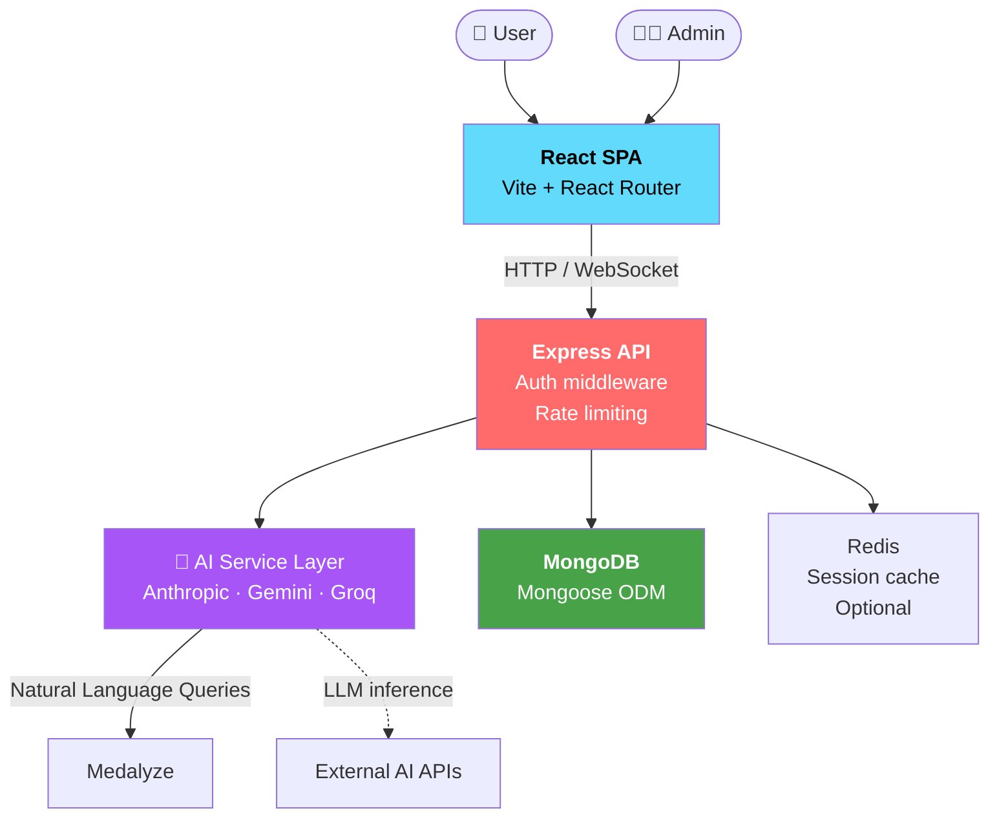
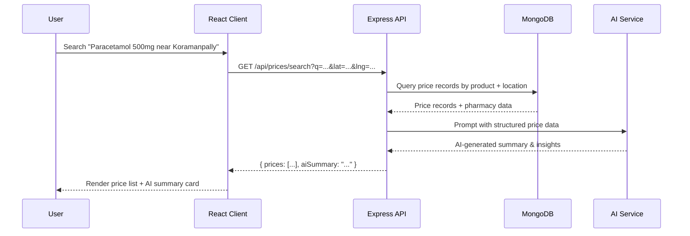

# Medalyze — AI-Powered Hyperlocal Pharmaceutical Pricing Tracker


> Intelligent, location-aware pharmaceutical price discovery — powered by AI to surface real-world drug pricing trends across neighborhoods and regions.

Medalyze aggregates pharmaceutical pricing data, geocodes pharmacy locations, and leverages large language models to generate AI summaries that help consumers and healthcare stakeholders make informed purchasing decisions.

---

## Status Badges

```
[](LICENSE)
[](https://github.com/your-org/medalyze)
[](https://nodejs.org)
[](https://react.dev)
[](https://expressjs.com)
[](https://mongodb.com)
[](https://vercel.com)
```

---

## Visual Demo

> **Replace `link` placeholders below with actual screenshot URLs before publishing.**


### Screenshots

| Dashboard | Price Discovery | AI Insights |
|:---------:|:---------------:|:-----------:|
|  |  |  |

---

## System Design & Architecture

### High-Level Overview

Medalyze follows a **client–server–database** three-tier architecture:

1. **Client (React + Vite)** — Single-page application with route-based navigation, state management via Zustand, and server state synchronization via TanStack Query.
2. **Server (Express.js)** — RESTful API exposing endpoints for auth, product/price management, AI-powered summaries, and location services. Integrates with multiple LLM providers (Anthropic, Google Gemini, Groq).
3. **Database (MongoDB via Mongoose)** — Document store for users, products, pharmacies, price records, and location metadata.

### Architecture Diagram



### Data Flow



---

## Tech Stack

| Layer | Technology | Version | Purpose |
|-------|-----------|---------|---------|
| **Frontend** | React | 19.2.4 | UI framework |
| **Frontend Build** | Vite | 8.0.1 | Dev server & bundler |
| **Routing** | React Router | 7.14.0 | SPA navigation |
| **State Management** | Zustand | 5.0.12 | Lightweight global state |
| **Server State** | TanStack Query | 5.96.2 | Data fetching & caching |
| **HTTP Client** | Axios | 1.14.0 | API calls |
| **Charts** | Recharts | 3.8.1 | Data visualization |
| **Animations** | GSAP | 3.14.2 | Scroll & UI animations |
| **Toasts** | react-hot-toast | 2.6.0 | Notification toasts |
| **Backend** | Express.js | 5.2.1 | REST API server |
| **Database** | MongoDB / Mongoose | 9.4.1 | Data persistence |
| **Auth** | JWT + bcryptjs | — | Stateless auth |
| **AI** | Anthropic SDK | 0.82.0 | Claude integration |
| **AI** | Google Generative AI | 0.24.1 | Gemini integration |
| **AI** | Groq SDK | 1.1.2 | Fast LLM inference |
| **Dev** | Nodemon | 3.1.14 | Auto-restart server |

### Infrastructure

```
React SPA (Vite)  ──►  Express API  ──►  MongoDB
     │                    │
     │               ┌────┴────┐
     │               ▼         ▼
     │          AI Service  External
     │          (Claude/    AI APIs
     │           Gemini/
     │           Groq)
     │
     ▼
  Vercel (hosting)
```

---

## How It Works — Under the Hood

### 1. User Authentication

```
1. User submits credentials → /api/auth/login
2. Server validates with bcrypt → issues JWT (24h expiry)
3. Client stores JWT in Zustand + localStorage
4. Subsequent requests include Bearer token in Authorization header
5. Auth middleware on protected routes validates token
```

### 2. Price Discovery & Search

```
1. User enters natural-language query (e.g., "Dolo 650 near Koramanpally")
2. Frontend sends GET /api/prices/search with:
   - q: search term
   - lat / lng: geocoordinates (from browser or selected location)
3. Backend queries MongoDB:
   - Product name fuzzy match
   - Geo-near query on pharmacy coordinates
   - Price range filter (optional)
4. Results sorted by distance + price
5. AI summary generated from top results
```

### 3. AI Insight Generation

```
1. Price records returned from MongoDB
2. Server builds structured prompt with:
   - Top 10 nearby pharmacies
   - Price range statistics
   - Product details (salt, manufacturer, form)
3. Prompt sent to configured AI provider (Claude/Gemini/Groq)
4. Structured JSON response extracted:
   { summary, priceTrend, recommendation, alternatives }
5. Response cached in Redis (TTL: 1 hour) to avoid repeated API calls
```

### 4. Location Management

```
1. Admin adds pharmacy with address → geocoded via Nominatim / Google
2. Coordinates stored in MongoDB as GeoJSON Point
3. User selects a location → stored in localStorage as default
4. All price queries filter by proximity (default radius: 5km)
5. Location list cached for performance
```

### 5. Admin Workflow

```
1. Admin logs in → JWT role = 'admin'
2. Can CRUD products, prices, locations
3. Analytics dashboard shows:
   - Total products / pharmacies / price records
   - Monthly price trends
   - AI usage & cache hit rates
```

---

## Getting Started

### Prerequisites

| Requirement | Minimum Version | Install |
|-------------|----------------|---------|
| Node.js | 18.0+ | [nodejs.org](https://nodejs.org) |
| npm | 9.0+ | Comes with Node |
| MongoDB | 6.0+ | [mongodb.com](https://www.mongodb.com) or use MongoDB Atlas |

### Installation

```bash
# 1. Clone the repository
git clone https://github.com/your-org/medalyze.git
cd medalyze

# 2. Install server dependencies
cd server && npm install

# 3. Install client dependencies
cd ../client && npm install

# 4. Create environment files
cp server/.env.example server/.env
cp client/.env.example client/.env
```

### Environment Variables

**`server/.env`**
```env
# Server
PORT=3001
NODE_ENV=development

# MongoDB
MONGO_URI=mongodb://localhost:27017/medalyze
# Or for Atlas:
# MONGO_URI=mongodb+srv://<user>:<password>@cluster.mongodb.net/medalyze

# JWT
JWT_SECRET=your-super-secret-jwt-key-change-in-production
JWT_EXPIRES_IN=24h

# AI Providers (at least one required)
ANTHROPIC_API_KEY=sk-ant-...
GOOGLE_GENERATIVE_AI_API_KEY=AIza...
GROQ_API_KEY=gsk_...

# Geocoding (optional)
GEOCODING_API_KEY=your-geocoding-api-key
```

**`client/.env`**
```env
VITE_API_BASE_URL=http://localhost:3001
VITE_APP_NAME=Medalyze
```

### Running Locally

```bash
# Terminal 1 — Start MongoDB (if running locally)
mongod --dbpath /usr/local/var/mongodb

# Terminal 2 — Start backend server
cd server && npm run dev
# Server runs on http://localhost:3001

# Terminal 3 — Start frontend dev server
cd client && npm run dev
# Client runs on http://localhost:5173
```

### Build for Production

```bash
# Client build (outputs to client/dist)
cd client && npm run build

# Server serves the built client in production
cd server && npm start
```

### Verify Installation

```bash
# Health check
curl http://localhost:3001/api/health

# Expected response:
# { "status": "ok", "timestamp": "...", "db": "connected" }
```

---

## Folder Structure

```
medalyze/
├── client/                         # React frontend (Vite)
│   ├── public/
│   │   └── icons.svg               # App SVG icons
│   ├── src/
│   │   ├── api/                   # API client modules
│   │   │   ├── ai.js              # AI endpoints
│   │   │   ├── auth.js            # Auth endpoints
│   │   │   ├── axios.js           # Axios instance + interceptors
│   │   │   ├── locations.js       # Location endpoints
│   │   │   ├── prices.js          # Price search endpoints
│   │   │   └── products.js        # Product CRUD endpoints
│   │   ├── assets/                # Static assets
│   │   │   ├── hero.png           # Hero image
│   │   │   └── vite.svg           # Vite logo
│   │   ├── components/            # Reusable UI components
│   │   │   ├── AiSummaryCard.jsx  # AI summary display card
│   │   │   ├── PageLayout.jsx     # Page wrapper with sidebar
│   │   │   ├── Sidebar.jsx        # Navigation sidebar
│   │   │   └── StatCard.jsx       # Dashboard stat card
│   │   ├── pages/                 # Route-level page components
│   │   │   ├── Admin.jsx          # Admin dashboard
│   │   │   ├── Dashboard.jsx      # Main dashboard
│   │   │   ├── Locations.jsx      # Pharmacy locations
│   │   │   ├── Login.jsx          # User login
│   │   │   ├── Preferences.jsx    # User preferences
│   │   │   ├── Prices.jsx         # Price search & results
│   │   │   ├── Products.jsx       # Product management
│   │   │   └── Register.jsx       # New user registration
│   │   ├── store/                 # Zustand state stores
│   │   │   └── authStore.js       # Auth state (token, user)
│   │   ├── App.jsx                # Root component + routing
│   │   └── main.jsx               # React entry point
│   ├── index.html
│   ├── package.json
│   ├── vite.config.js             # Vite configuration
│   └── eslint.config.js
│
├── server/                         # Express.js backend
│   ├── index.js                   # Server entry point
│   ├── package.json
│   └── node_modules/
│
├── .gitignore
├── LICENSE
└── README.md
```

---

## API Endpoints

> Base URL: `http://localhost:3001/api`

### Authentication

| Method | Endpoint | Description | Auth |
|--------|----------|-------------|------|
| `POST` | `/auth/register` | Register new user | No |
| `POST` | `/auth/login` | Login & receive JWT | No |
| `GET` | `/auth/me` | Get current user profile | Yes |

### Products

| Method | Endpoint | Description | Auth |
|--------|----------|-------------|------|
| `GET` | `/products` | List all products | Yes |
| `POST` | `/products` | Create product | Admin |
| `PUT` | `/products/:id` | Update product | Admin |
| `DELETE` | `/products/:id` | Delete product | Admin |

### Prices

| Method | Endpoint | Description | Auth |
|--------|----------|-------------|------|
| `GET` | `/prices/search` | Search prices by query + location | Yes |
| `POST` | `/prices` | Add price record | Admin |
| `PUT` | `/prices/:id` | Update price record | Admin |
| `DELETE` | `/prices/:id` | Delete price record | Admin |

### AI Insights

| Method | Endpoint | Description | Auth |
|--------|----------|-------------|------|
| `POST` | `/ai/summary` | Generate AI price summary | Yes |

**Request:**
```json
POST /api/ai/summary
{
  "query": "Paracetamol 500mg near Koramanpally",
  "results": [...priceRecords]
}
```

**Response:**
```json
{
  "summary": "Based on 12 pharmacies within 5km...",
  "priceTrend": "stable",
  "recommendation": "Best value at MedPlus Pharmacy...",
  "alternatives": ["Dolo 650", "Crocin Advance"]
}
```

### Locations

| Method | Endpoint | Description | Auth |
|--------|----------|-------------|------|
| `GET` | `/locations` | List all pharmacy locations | Yes |
| `POST` | `/locations` | Add pharmacy location | Admin |
| `PUT` | `/locations/:id` | Update location | Admin |

---

## Future Scope

- [ ] **Real-time price alerts** — Push notifications when a tracked drug hits a target price
- [ ] **Multi-language support** — i18n for regional languages (Hindi, Telugu, Tamil)
- [ ] **Price prediction** — ML model to forecast price trends based on historical data
- [ ] **Social features** — Share price finds, community ratings for pharmacies
- [ ] **QR code scanning** — Scan drug pack QR to instantly get price comparisons
- [ ] **Offline mode** — Service worker caching for basic searches without connectivity
- [ ] **PWA install** — Add to home screen with full native-like experience
- [ ] **Map integration** — Leaflet/OpenStreetMap for in-app map view of pharmacy locations

---

## Contributing

Contributions are welcome! Please follow these steps:

```bash
# 1. Fork the repository

# 2. Create a feature branch
git checkout -b feature/your-feature-name

# 3. Commit your changes
git commit -m "feat: add your feature description"

# 4. Push to your fork
git push origin feature/your-feature-name

# 5. Open a Pull Request
#    Target: main branch
#    Include: description, screenshots, test steps
```

### Coding Standards

- **Frontend:** Follow React hooks best practices; use functional components only
- **Backend:** Async/await with proper error handling; never expose raw errors to client
- **Commits:** Use conventional commits (`feat:`, `fix:`, `chore:`, `docs:`)
- **Tests:** Ensure new features have corresponding tests (Jest for backend, Vitest for frontend)

---

## License

This project is licensed under the **MIT License** — see [LICENSE](LICENSE) for details.

---

*Replace all `https://via.placeholder.com/...` URLs with actual project screenshots before publishing.*